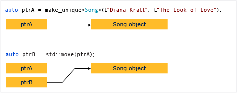

# Как создавать и использовать экземпляры unique_ptr

[Unique_ptr](../standard-library/unique-ptr-class.md) не имеет общего доступа к указателю. Его нельзя скопировать на другой `unique_ptr`, передать по значению в функцию или использовать в любом C++ алгоритме стандартной библиотеки, требующем копирования. `unique_ptr` можно только переместить. Это означает, что владение ресурсов памяти переносится в другое `unique_ptr` и оригинал `unique_ptr` больше им не владеет. Рекомендуется ограничить объект одним владельцем, поскольку множественное владение усложняет логику программы. Поэтому, если требуется интеллектуальный указатель для обычного C++ объекта, используйте `unique_ptr`, а при создании `unique_ptr`используйте вспомогательную функцию [make_unique](../standard-library/memory-functions.md#make_unique) .

Следующая схема иллюстрирует передачу прав собственности между двумя экземплярами `unique_ptr`.

`unique_ptr` определяется в заголовке `<memory>` C++ стандартной библиотеки. Она точно так же эффективна, как необработанный указатель и может C++ использоваться в контейнерах стандартной библиотеки. Добавление `unique_ptr` экземпляров в C++ контейнеры стандартных библиотек является эффективным, так как конструктор перемещения `unique_ptr` устраняет необходимость в операции копирования.

## Пример 1

В следующем примере описывается порядок создания экземпляров `unique_ptr` и передачи их между функциями.

[!code-cpp[stl_smart_pointers#210](codesnippet/CPP/how-to-create-and-use-unique-ptr-instances_1.cpp)]

В этих примерах демонстрируется эта базовая характеристика `unique_ptr`: ее можно изменить, но не для копирования. "Перемещение" перемещает владельца в новый `unique_ptr` и сбрасывает старый `unique_ptr`.

## Пример 2

В следующем примере описывается порядок создания экземпляров `unique_ptr` и их использования в векторе.

[!code-cpp[stl_smart_pointers#211](codesnippet/CPP/how-to-create-and-use-unique-ptr-instances_2.cpp)]

Обратите внимание, что в диапазоне для цикла `unique_ptr` передается по ссылке. При попытке передачи по значению компилятор выдаст ошибку, поскольку конструктор копирования `unique_ptr` удален.

## Пример 3

В следующем примере показана инициализация `unique_ptr`, являющегося членом класса.

[!code-cpp[stl_smart_pointers#212](codesnippet/CPP/how-to-create-and-use-unique-ptr-instances_3.cpp)]

## Пример 4

[Make_unique](../standard-library/memory-functions.md#make_unique) можно использовать для создания `unique_ptr` массива, но нельзя использовать `make_unique` для инициализации элементов массива.

[!code-cpp[stl_smart_pointers#213](codesnippet/CPP/how-to-create-and-use-unique-ptr-instances_4.cpp)]

Дополнительные примеры см. в разделе [make_unique](../standard-library/memory-functions.md#make_unique).

## См. также:

[Интеллектуальные указатели (современный C++)](smart-pointers-modern-cpp.md) 
[make_unique](../standard-library/memory-functions.md#make_unique)
