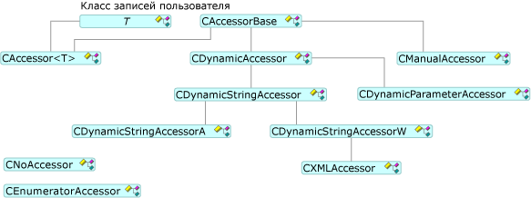

# Методы доступа и наборы строк

Чтобы задать и получить данные, OLE DB шаблоны используют метод доступа и набор строк с помощью класса [CAccessorRowset](../../data/oledb/caccessorrowset-class.md) . Этот класс может выполнять несколько методов доступа различных типов.

## Типы методов доступа

Все методы доступа являются производными от [CAccessorBase](../../data/oledb/caccessorbase-class.md). `CAccessorBase` предоставляет как параметр, так и привязку к столбцу.

На следующем рисунке показаны типы методов доступа.

 
Классы методов доступа

- [Какцессор](../../data/oledb/caccessor-class.md) Используйте этот метод доступа, если во время разработки известна структура источника базы данных. `CAccessor` статически привязывает запись базы данных, содержащую буфер, к источнику данных.

- [CDynamicAccessor](../../data/oledb/cdynamicaccessor-class.md) Используйте этот метод доступа, если вы не знакомы со структурой базы данных во время разработки. `CDynamicAccessor` вызывает метод `IColumnsInfo::GetColumnInfo` для получения сведений о столбце базы данных. Он создает и управляет методом доступа и буфером.

- [CDynamicParameterAccessor](../../data/oledb/cdynamicparameteraccessor-class.md) Используйте этот метод доступа для управления неизвестными типами команд. При подготовке команд `CDynamicParameterAccessor` может получать из интерфейса сведения о параметрах `ICommandWithParameters` , если поставщик поддерживает `ICommandWithParameters` .

- [CDynamicStringAccessor](../../data/oledb/cdynamicstringaccessor-class.md), [CDynamicStringAccessorA](../../data/oledb/cdynamicstringaccessora-class.md)и [CDynamicStringAccessorW](../../data/oledb/cdynamicstringaccessorw-class.md) используют эти классы, если нет сведений о схеме базы данных. `CDynamicStringAccessorA` Извлекает данные в виде строк ANSI; `CDynamicStringAccessorW` извлекает данные в виде строк Юникода.

- [CManualAccessor](../../data/oledb/cmanualaccessor-class.md) С помощью этого класса можно использовать любые типы данных, если поставщик может преобразовать тип. Он обрабатывает как результирующие столбцы, так и параметры команды.

В следующей таблице приведена сводка поддержки в типах методов доступа к шаблону OLE DB.

|Тип метода доступа|Динамический|Обрабатывает параметры|Буфер|Несколько методов доступа|
|-------------------|-------------|--------------------|------------|------------------------|
|`CAccessor`|Нет|Да|User (Пользователь)|Да|
|`CDynamicAccessor`|Да|Нет|Шаблоны OLE DB|Нет|
|`CDynamicParameterAccessor`|Да|Да|Шаблоны OLE DB|Нет|
|`CDynamicStringAccessor[A,W]`|Да|Нет|Шаблоны OLE DB|Нет|
|`CManualAccessor`|Да|Да|User (Пользователь)|Да|

## Типы наборов строк

Шаблоны OLE DB поддерживают три типа наборов строк (см. предыдущий рисунок): отдельные наборы строк (реализованные методом [CRowset](../../data/oledb/crowset-class.md)), наборы строк (реализованные в [CBulkRowset](../../data/oledb/cbulkrowset-class.md)) и наборы строк массива (реализованные в [CArrayRowset](../../data/oledb/carrayrowset-class.md)). Один набор строк извлекает дескриптор одной строки при `MoveNext` вызове метода. Групповые наборы строк могут выбирали несколько дескрипторов строк. Наборы строк массива — это наборы строк, доступ к которым можно получить с помощью синтаксиса массива.

На следующем рисунке показаны типы наборов строк.

 
Классы наборов строк

[Наборы строк схемы](../../data/oledb/obtaining-metadata-with-schema-rowsets.md) не обращаются к данным в хранилище данных, а вместо этого обращаются к сведениям о хранилище данных, называемом Metadata. Наборы строк схемы обычно используются в ситуациях, когда структура базы данных не известна во время компиляции и должна быть получена во время выполнения.

## См. также раздел

[Шаблоны объекта-получателя OLE DB](../../data/oledb/ole-db-consumer-templates-cpp.md)
