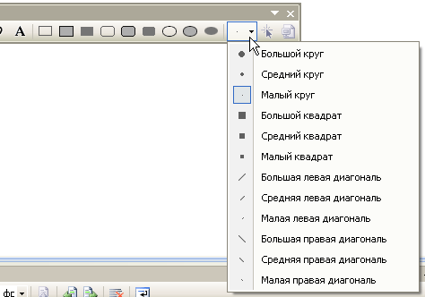

# Панель инструментов (редактор C++ изображений для значков)

**Редактор изображений** инструментов содержит инструменты для рисования, рисования, ввода текста, стирания и управлении представлениями. Он также содержит селектора параметр, с помощью которого можно выбрать параметры для каждого инструмента. Например можно выбрать из различных кисти, масштаб увеличения и стили линий.

> [!NOTE]
> Все инструменты, доступные в **редактор изображений** инструментов также доступны из **изображение** меню (в разделе **средства** команду).

 панель инструментов редактора изображений

Для использования **редактор изображений** инструментов и **параметр** селектора, выберите инструмент, или параметр, что требуется.

> [!TIP]
> Всплывающие подсказки отображаются при наведении курсора на кнопку панели инструментов. Эти советы помогут определить назначение каждой кнопки.

С помощью **параметр** селектор, можно указать ширину линии, кисть штриха и многое другое. Значок на **параметр** выбора переключателя изменяется в зависимости от того, какое средство выбора.

 селектор параметров на панели инструментов редактора изображений

Сведения о добавлении ресурсов в управляемые проекты см. в разделе [ресурсы в приложениях для настольных систем](/dotnet/framework/resources/index) в *руководства разработчика .NET Framework*. Сведения о вручную добавлять файлы ресурсов в управляемые проекты, осуществлять доступ к ресурсам, отображать статические ресурсы и присваивать строки ресурсов свойствам, см. в разделе [Создание файлов ресурсов для приложений рабочего стола](/dotnet/framework/resources/creating-resource-files-for-desktop-apps). Сведения о глобализации и локализации ресурсов в управляемых приложениях, см. в разделе [Globalizing and Localizing .NET Framework Applications](/dotnet/standard/globalization-localization/index).

## Используйте диалоговое окно средства текста

Используйте **текст** диалоговое окно для добавления текста к ресурсу курсор, точечный рисунок или значок.

Чтобы открыть это диалоговое окно, откройте [редактор изображений](../windows/window-panes-image-editor-for-icons.md). Выберите **средства** из **изображение** меню, а затем выберите **текст** команды.

### Кнопка шрифта

Открывает **шрифт текста** диалоговое окно, в котором можно изменить шрифт, стиль или размер шрифта курсора. Изменения применяются к тексту, отображаемому в **текст** области.

Чтобы открыть это диалоговое окно, выберите **шрифта** кнопку **текст** диалоговое окно. Ниже приведены доступные свойства.

|Свойство.|Описание|
|---|---|
|**Шрифт**|Список доступных шрифтов.|
|**Стиль шрифта**|Перечисляются доступные стили для заданного шрифта.|
|**Size**|Список доступных размеров для выбранного шрифта.|
|**Пример**|Показан пример того, как будет выглядеть текст с заданными параметрами шрифта.|
|**Сценарий**|Список доступных языков сценариев, для заданного шрифта. При выборе другого языка, набор символов для этого языка станет доступен при создании многоязычных документов.|

#### Изменение шрифта текста на изображении

Следующая процедура является примером того, как добавить текст в значок в приложении Windows и управления ими шрифт текста.

1. Создание приложения C++ Windows Forms. Дополнительные сведения см. в разделе [Создание проекта приложения Windows](/previous-versions/visualstudio/visual-studio-2010/42wc9kk5). *App.ico* файл добавляется в проект по умолчанию.

1. В **обозревателе решений**, дважды щелкните файл *app.ico*. [Редактор изображений](../windows/image-editor-for-icons.md) будет открыт.

1. Из **изображение** меню, выберите **средства** , а затем выберите **текст**. **Текст** появится диалоговое окно.

1. В **текст** диалоговом окне *C++* в пустой текстовой области. Этот текст будет отображаться в поле с изменяемыми размерами в верхнем левом углу *app.ico*в **редактор изображений**.

1. В **редактор изображений**, перетащите поле с изменяемыми размерами центр app.ico, чтобы улучшить читаемость текста.

1. В **текст** выберите **шрифта** кнопки. **Шрифт текста** появится диалоговое окно.

1. В **шрифт текста** выберите **Times New Roman** из списка доступных шрифтов, которые перечислены в **шрифта** поле со списком.

1. Выберите **Полужирный** из списка доступных стилей в **стиль шрифта** поле со списком.

1. Выберите **10** из списка доступных размеров в **размер** поле со списком.

1. Нажмите кнопку **OK**. **Шрифт текста** диалоговое окно закроется, и новые параметры шрифта будет применяться к тексту.

1. Выберите **закрыть** кнопку **текст** диалоговое окно. Можно изменять поля вокруг текста удаляются из **редактор изображений**.

### Текстовое поле

Отображает текст, отображаемый как часть ресурса. Изначально область пуста.

> [!NOTE]
> Если **прозрачный фон** не установлен, будут помещены только текст в изображение. Если **непрозрачный фон** имеет значение, ограничивающий прямоугольник, заполненный [цвет фона](../windows/selecting-foreground-or-background-colors-image-editor-for-icons.md), будут располагаться за текстом. Дополнительные сведения см. в разделе [Выбор непрозрачный и прозрачный фон](../windows/choosing-a-transparent-or-opaque-background-image-editor-for-icons.md).

Вы можете щелкнуть **текст** диалоговое окно, чтобы получить доступ к контекстное меню по умолчанию, который содержит список стандартных команд Windows.

## Чтобы отобразить или скрыть панель инструментов редактора изображений

Поскольку многие из инструментов рисования доступны из [клавиатуры](../windows/accelerator-keys-image-editor-for-icons.md), иногда полезно скрыть **редактор изображений** панели инструментов.

На **представление** меню, выберите **панелей инструментов** выберите **редактор изображений**.

   > [!NOTE]
   > Элементы этой панели инструментов появится недоступен, если файл изображения из текущего проекта или решения не открыт в **редактор изображений**. См. в разделе [создание значка или другие изображения](../windows/creating-an-icon-or-other-image-image-editor-for-icons.md), сведения о добавлении файлов изображений в проекты.

## Требования

Нет

## См. также

[Окно "цвета"](../windows/colors-window-image-editor-for-icons.md) 
[Изменение графических ресурсов](../windows/editing-graphical-resources-image-editor-for-icons.md) 
[Сочетания клавиш](../windows/accelerator-keys-image-editor-for-icons.md) 